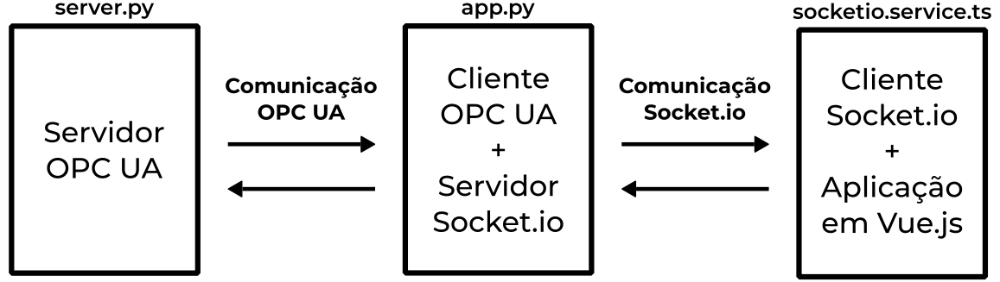

# dashboard-smar-pd3
Dashboard que utiliza OPC UA e comunicação bidirecional de tempo real aplicado à planta didática pd3-f da smar.



Primeiro, clone o repositório.
```bash
git clone https://github.com/vinimlo/dashboard-smar-pd3.git
```

Depois, entre na pasta raiz do projeto.
```bash
cd dashboard-smar-pd3
```

Execute os comandos sempre da __raiz do projeto.__

Para iniciar o ambiente virtual, digite
```bash
make init
```

Ao rodar pela primeira vez, instale as dependências do projeto.
```bash
make install
```

Depois, basta subir as aplicações individualmente.

Suba o servidor OPC UA
```bash
make server
```

Suba o cliente Async OPC UA
```bash
make client
```

Caso deseje rodar o dashboard no modo desenvolvimento, utilize o comando a seguir.
```bash
make run_web_development
```

Para buildar e executar a aplicação no modo produção, utilize os comandos a seguir.
```bash
make build_dashboard
make run_web_production
```